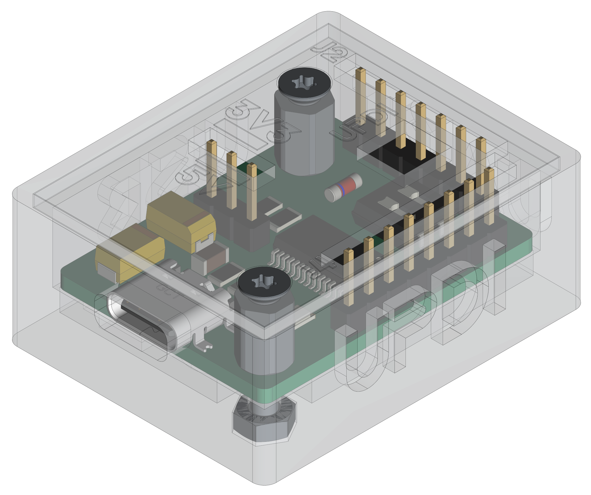
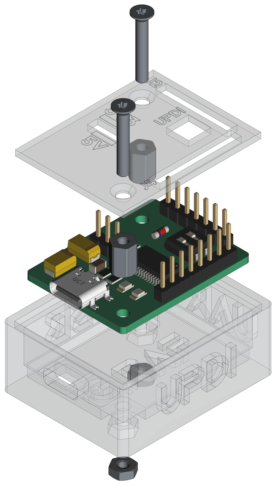
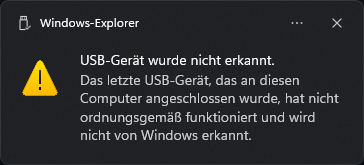

[](https://github.com/0x007e/u3a) [](https://creativecommons.org/licenses/by-nc-sa/4.0/legalcode) 

# `U3A` - USB/UART/UPDI - Adapter

[](https://deepwiki.com/0x007E/u3a)

The `U3A` project is based on a ([FT232](#additional-information)) that ist used as USB (Full Speed) to serial UART transceiver. Most signals of the ([FT232](#additional-information)) are routed to the connector pins `J2` and `J4`. Whithin the DIP switches the adapter can be switched from `UART` to `UPDI` mode to program microcontrollers. It is possible to select between two voltage sources. Either `5V` from USB or `3V3` from the internal LDO on the board.

> The LDO itself can drive around `800 mA`. Therefore it is necessary to install a cooling unit inside the housing. The mount for this is already provided in the housing.

| Experience | Level |
|:------------|:-----:|
| Soldering   |  |
| Mechanical  |  |

# Downloads

| Type      | File               | Description              |
|:---------:|:------------------:|:-------------------------|
| Schematic | [pdf](https://github.com/0x007E/u3a/releases/latest/download/schematic.pdf) / [cadlab](https://cadlab.io/project/29697/main/files) | Schematic files |
| Board | [pdf](https://github.com/0x007E/u3a/releases/latest/download/pcb.pdf) / [cadlab](https://cadlab.io/project/29697/main/files) | Board file |
| Drill | [pdf](https://github.com/0x007E/u3a/releases/latest/download/drill.pdf) | Drill file |
| PCB | [zip](https://github.com/0x007E/u3a/releases/latest/download/kicad.zip) / [tar](https://github.com/0x007E/u3a/releases/latest/download/kicad.tar.gz) | KiCAD/Gerber/BoM/Drill files |
| Mechanical | [zip](https://github.com/0x007E/u3a/releases/latest/download/freecad.zip) / [tar](https://github.com/0x007E/u3a/releases/latest/download/freecad.tar.gz) | FreeCAD/Housing and PCB (STEP) files     |

# Hardware

There are two parts of the hardware. The pcb and the housing of the `U3A`. The pcb is created with [KiCAD](#additional-information) and the housing with `FreeCAD`. All files are built with `github actions` so that they are ready for a production environment. The housing is printed with a 3D-printer (`Dremel 3D40`).

## PCB

The circuit board is populated on both sides (Top, Bottom). The best way for soldering the `SMD` components is within a vapor phase soldering system and for the `THT` components with a standard soldering system.

### Top Layer


### Bottom Layer


## Mechanical

The housing has a tolerance of `0.2mm` on each side of the case. So the pcb should fit perfectly in the housing. The tolerance can be modified with `FreeCAD` in the `Parameter` Spreadsheet.

### Assembled



#### Exploded



# Connection/Setup

The `U3A` is powerd over USB with `5V`. The voltage of the pins can be setup through jumper `J1`. Either `5V` or `3V3`. The output of the system is driven by `CBUS4`. It needs to be configured through [FT_PROG](#additional-information). Mostly pins of the IC are routed to the connectors `J2` and `J4`

## Simple loopback setup for testing purpose

``` bash
#
#               +-----------------------------------+      +---------------------+
#               |J2     U                       +---+---+  |                     |
#            +--+--+    S                       |  USB  |--+ +-----------------+ |
#            | VCC |    B      UPDI             +---+---+  | | TeraTerm        | |
#            | GND |    /    +---+---+              |      | | ~~~~~~~~        | |
#            | PDI |    U    |   |   |              |      | | ~~~~~           | |
#            | CTS |    A    |   |   |              |      | | ~~~~~~~~~~~~    | |
#      L     | RTS |    R    | X | X |              |      | |                 | |
#      O +---+ TXD |    T    +---+---+     +-+      |      | +-----------------+ |
#      O +---+ RXD |    /                 / /       |      |                     |
#      P     +-----+    U               +-+-+-+-+-+-+      | Computer            |
#      B        |       P               | 5V  | 3V3 |      |                     |
#      A        |       D               +-----+-----+      +---------------------+
#      C        |  J4   I                           |
#      K        | +---+---+---+---+---+---+---+---+ |
#               | | V | C | C | D | D | D | R | G | |
#               +-+ C | B | B | C | T | C | I | N +-+
#                 | C | 3 | 2 | D | R | R |   | D |
#                 +---+---+---+---+---+---+---+---+
```

# Errata/Errors

On some `FT232RL` (NRND) a usb-connection issue occurs if the volatge jumper (`J1`) is set to `3V3`. To solve this issue remove jumper `J1` before the usb-port is connected to a computer and reinsert the jumper `J1` after the connection between the computer and `FT232` is initiated.



# Additional Information

| Type       | Link                                                                 | Description                                          |
|:----------:|:--------------------------------------------------------------------:|:-----------------------------------------------------|
| FT232RL    | [pdf](https://ftdichip.com/wp-content/uploads/2020/08/DS_FT232R.pdf) | USB to serial UART interface IC                      |
| FT_PROG    | [web](https://ftdichip.com/utilities/#ft_prog)                       | EEPROM programming utility for use with FTDI devices |
| KiCAD      | [web](https://www.kicad.org/)                                        | KiCAD project page                                   |
| FreeCAD    | [web](https://www.freecad.org/)                                      | FreeCAD project page                                 |

---

R. GAECHTER
